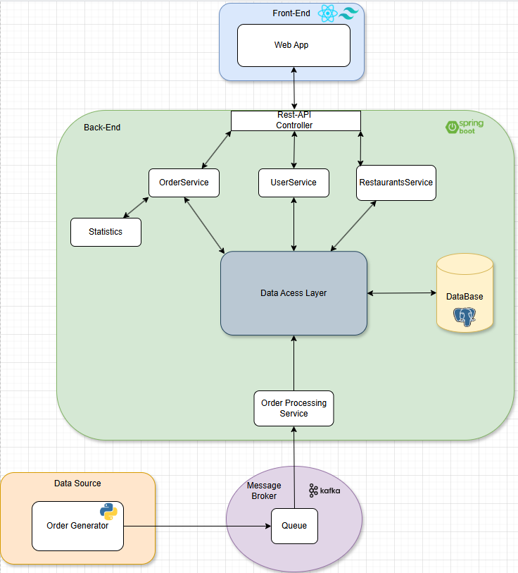

# Project Abstract
-- title and brief description of the project features
# Project Team
* **Team manager**: 114547 - João Monteiro
* **Product owner**: 113278 - Jorge Domingues
* **Architect**: 113144 - João Viegas 
* **DevOps master**: 113893 - Guilherme Santos
# Architecture Diagram

# Bookmarks
-- links to quickly access all project resources

# Running the project
## Enter the project folder
```bash
cd proj
```
## Run the containers environment
```bash
docker compose up --build
```
## ShutDown the Application
```bash
docker compose down
```