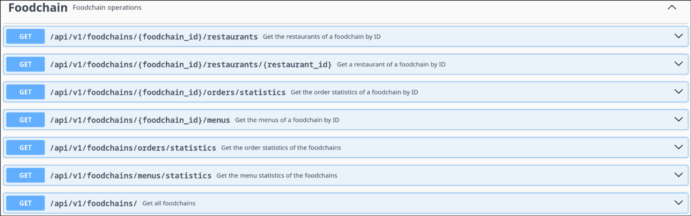
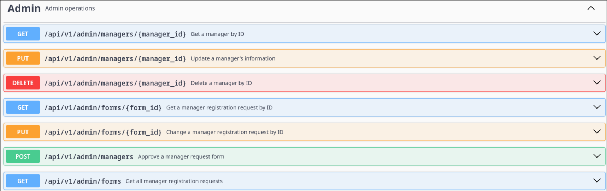

# API Documentation
## FoodChains


## Restaurants


## Admin


## Authentication


### This documentation is generated by swagger so, to see it you need to run the application first
```bash
cd proj
docker compose up
```

### Then access:
http://localhost:8080/swagger-ui/index.html